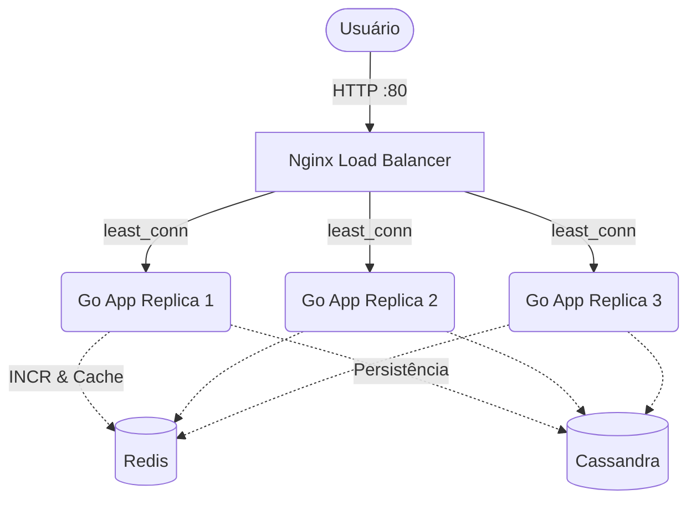

# Shorner URL 🔗

Um encurtador de URLs altamente escalável, performático e resiliente, escrito em **Go**. 

O projeto foi construído utilizando os princípios de **Clean Architecture** (Ports & Adapters) e **Package-by-Feature**, evoluindo de uma arquitetura in-memory para uma infraestrutura robusta de produção utilizando **Cassandra**, **Redis**, **Nginx** e **Docker**.

---

## 🎯 Requisitos de Sistema e Escala

Este projeto foi desenhado para atender rigorosamente aos seguintes requisitos e métricas de capacidade:

1. **Volume Massivo:** O sistema deve suportar **100 milhões de URLs geradas por dia**. Para suportar essa volumetria sem esgotar as chaves, adotou-se o tamanho de hash de 7 caracteres utilizando Base62, o que garante mais de 3,5 trilhões de combinações únicas (`62^7`).
2. **URLs Curtas:** O tamanho da URL gerada deve ser o mais curto possível.
3. **Padrão Limpo:** Somente caracteres alfanuméricos (letras e números) são permitidos na URL gerada.
4. **Carga Read-Heavy:** O sistema deve suportar uma proporção de tráfego de **1 escrita para cada 10 leituras**. Para atender esse requisito e otimizar a performance, optou-se por gerar o código curto matematicamente a partir de um ID único do Redis (`INCR`). Isso evita que o sistema precise realizar consultas no banco de dados para checar se uma string aleatória já existe (colisão) a cada nova inserção, poupando o banco. As leituras também são blindadas por um cache (*Cache-Aside*).
5. **Armazenamento Eficiente:** O comprimento médio das URLs originais armazenadas no banco é de 100 bytes.
6. **Retenção de Longo Prazo:** As URLs devem ser mantidas no banco de dados por um período mínimo de **10 anos** (justificando a escolha do Cassandra, que permite escalabilidade horizontal contínua de disco).
7. **Alta Disponibilidade (24/7):** O sistema não pode cair. Ele foi modelado para operar em contingência contínua com Load Balancer, múltiplas réplicas da API e banco de dados distribuído.

---

## 🚀 Arquitetura e Fluxo

O sistema utiliza um padrão distribuído com cache e balanceamento de carga para garantir alta disponibilidade e leitura em milissegundos:



### Decisões de Design
1. **Geração de Códigos Curtos (Redis INCR + Hashids + Base62):** 
   Em vez de gerar strings aleatórias e ter que fazer queries pesadas no banco para evitar "colisões" (códigos duplicados), utilizamos uma abordagem matemática e determinística:
   * **Passo 1 (Atomicidade):** Usamos o comando `INCR` do Redis. Se três requisições chegarem ao mesmo tempo, o Redis garante que cada uma receba um ID numérico único (ex: `101`, `102`, `103`).
   * **Passo 2 (Ofuscação via Hashids):** Para não expor números sequenciais e previsíveis na URL para o usuário, o ID numérico passa pela biblioteca **Hashids**. Ela pega o número e, baseada em uma senha (*salt* configurada no seu `.env`), converte o número para uma string curta no padrão Base62 (`a-z, A-Z, 0-9`). O ID `101` vira algo como `L9dK`.
   * **Vantagem:** É impossível gerar um código curto repetido (livre de colisões). O processo roda 100% na memória do servidor Web em microssegundos, sem onerar o banco de dados.
2. **Cache-Aside Pattern:** O Redis atua como uma camada de cache na frente do Cassandra. Leituras batem primeiro no cache. Escritas atualizam o banco primário e já populam o cache (*write-through*).
3. **Persistência Orientada a Queries (Cassandra):** Modelagem com duas tabelas (`urls` e `urls_by_original`) atualizadas atomicamente via `logged batch` para garantir eficiência na busca e suporte a idempotência na criação.

---

## 🛠️ Stack Tecnológica

- **Linguagem:** Go 1.26
- **Router HTTP:** `chi/v5`
- **Banco de Dados:** Apache Cassandra 4
- **Cache & Contadores:** Redis 7
- **Load Balancer:** Nginx
- **Documentação:** Swagger (`swaggo/swag`)
- **Infraestrutura:** Docker & Docker Compose (Multi-stage build)
- **Outros:** `slog` (com `tint` para logs coloridos), `godotenv`.

---

## ✨ Funcionalidades

- ✅ **Encurtamento de URLs** com códigos curtos e ofuscados.
- ✅ **Idempotência:** O envio da mesma URL sempre retorna o código previamente gerado.
- ✅ **Redirecionamento Rápido:** Leituras do banco primário reduzidas a zero em casos de *cache hit*.
- ✅ **Alta Disponibilidade:** Load Balancer Nginx distribuindo tráfego para múltiplas réplicas da aplicação.
- ✅ **Swagger Integrado:** Documentação da API com interface gráfica para testes.
- ✅ **Health Checks:** Monitoramento de vida da aplicação e dos serviços.

---

## ⚙️ Variáveis de Ambiente (`.env`)

Crie um arquivo `.env` na raiz do projeto (use o `.env copy.example` como base):

```env
SERVER_PORT=8080
BASE_URL=http://localhost
HASH_SALT=minha-senha-secreta-em-producao

CASSANDRA_HOSTS=cassandra
CASSANDRA_KEYSPACE=shorner

REDIS_ADDR=redis:6379
REDIS_PASSWORD=
```

---

## 🏃 Como Executar

### 1. Produção / Completo (Docker Compose)
Inicia o Nginx, Cassandra (com auto-init do schema), Redis e 3 réplicas da aplicação Go.

```bash
docker compose up -d --build
```
Acesse a API em: `http://localhost`

### 2. Desenvolvimento Local
Inicia apenas os bancos de dados (Cassandra e Redis) expondo as portas para a máquina local.

```bash
# Sobe a infra de dev
docker compose -f docker-compose.dev.yml up -d

# Roda o servidor Go
go run cmd/server/main.go
```
Acesse a API em: `http://localhost:8080`

---

## 📚 Documentação da API (Swagger)

A API possui documentação interativa. Com a aplicação rodando, acesse no seu navegador:

- **Se rodando via Nginx (Docker Completo):** `http://localhost/swagger/index.html`
- **Se rodando Local:** `http://localhost:8080/swagger/index.html`

### Endpoints Principais

| Método | Rota | Descrição |
|--------|------|-------------|
| `POST` | `/api/shorten` | Cria/recupera uma URL encurtada (JSON: `{"url": "..."}`). |
| `GET`  | `/{code}` | Faz o redirecionamento (301) para a URL original. |
| `GET`  | `/api/urls/{code}` | Retorna as informações JSON sobre uma URL encurtada. |
| `GET`  | `/health` | Endpoint de verificação de vida da aplicação (Load Balancer). |

---

## 🧪 Testes

O projeto conta com testes unitários cobrindo desde as entidades de Domínio até o núcleo do Service, utilizando repositórios de memória virtuais.

```bash
go test ./... -v
```

---

## 🏗️ Como gerar o Swagger após mudanças
Sempre que fizer alterações nos comentários das rotas (em `internal/shorner/handler.go` ou `cmd/server/main.go`), regenere o Swagger:

```bash
go run github.com/swaggo/swag/cmd/swag@latest init -g cmd/server/main.go
```
